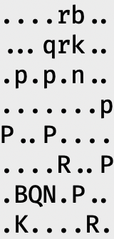
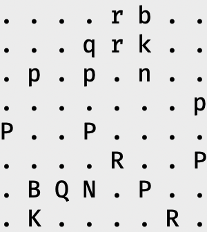
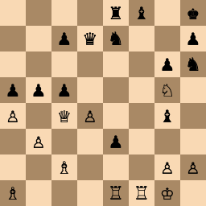

# chessfun - Printing Chess Boards in a Terminal
_( ... or how we go down the rabbit hole of terminal capabilities )_

## Introduction
When computers and chess cross paths, and especially when dabbling in chess programming, one common
need is printing a chess position to the screen. The most used and compact format is the [Forsyth–Edwards
Notation](https://en.wikipedia.org/wiki/Forsyth–Edwards_Notation) (FEN). This format lists all chess pieces using `KQRBNP` for white pieces, and `kqrbnp` for the
black ones, a single digit between `1` and `8` to represent that number of empty squares, and
slashes `/` to separate rows. So, the starting position is
`rnbqkbnr/pppppppp/8/8/8/8/PPPPPPPP/RNBQKBNR`. Other fields indicate the active player, en passant
and castling rights, as well as move counts. However, here I'd like to focus on showing what is
called the piece placement.

All images in this README were generated using code in this repository, and then captured directly
off of the terminal screen, except where explicit mentioned otherwise.

## Just Print It!
How hard can it be? We print the 64 positions in a rectangular grid. Done. OK, the empty space make
it hard to see the actual location of the pieces, so in come the dots. The normally excellent space
adjustments by the [Fira Code](https://github.com/tonsky/FiraCode) font are not helpful here, but really the board isn't at all square. After
adding spaces, it's at least usable.

GNU Chess 6.2.9 sticks with this third try and calls it a day. That's fair. Chess programs generally
implement a protocol like the Universal Chess Interface and delegate the UI to a graphical interface
at the other end. However, as I'm intending to do some chess programming, I'd like to work in a
terminal, directly interacting with code and chess positions from the command line.

|               First Try               |              Second Try               |               GNU Chess               |               Stockfish               |
| :-----------------------------------: | :-----------------------------------: | :-----------------------------------: | :-----------------------------------: |
|  |  |  |  |

## What about Unicode?
Even in the old IBM PC days, there were some box drawing characters to improve things. Going a bit
further, letters and boxes are great and all, but with Unicode can't we actually get some horsies and towers?
Next up: ♘ and ♜! Oh, no, that's not great at all! Those guys are tiny and look lost on the large
board and are not very readable! The chess symbols are letter sized, and take up a single space,
unlike Emoji that take up a more space. I didn't realize that until now: even in a monospaced font,
there are wider characters.

|              Box Drawing              |          Chess Figures + Box          |             Chess Figures             |
| :-----------------------------------: | :-----------------------------------: | :-----------------------------------: |
|  |  |  |

## A Checkered History
Maybe the mistake lies in drawing borders around the figures. Back in the time of dial-up modems and
Bulletin Board Systems (BBS-es), [ANSI escape
sequences](https://en.wikipedia.org/wiki/ANSI_escape_code) would allow for basic graphic
capabilities. Could we use to actually use a checkered background, eliminating the need for space
consuming box characters? Note that the colors below are just those for Visual Studio Code, as
different terminal programs have different colors, especially for the 16 "standard" ones. Moreover,
the foreground colors have been auto adjusted to preserve contrast. Other terminal programs don't do
this. YMMV.

|      Color Set      | Palette (VS Code)                                              |
| :-----------------: | :------------------------------------------------------------- |
| 16 Standard Colors  |   |
|  216 Extra Colors   |     |
| 24 Grayscale Colors |  |

|                Too Big                |           Too Blocky 8-bit            |             (For Scale)              |
| :-----------------------------------: | :-----------------------------------: | :----------------------------------: |
|  |  |  |
|      96x48 chars, 192x96 pixels       |      64x32 chars, 128x64 pixels       |              16x8 chars              |

Going full 8-bit retro-style is of course possible, but the resolution is too low for the 21st
century, especially if you also want to use the terminal for normal legible text. Note that in the
table above, all images have been scaled down by 50% compared to the rest of this text. While it
certainly is possible to improve over my Too Blocky pixel art attempt, and the auto-converted Too
Big possibly be made to look half-way decent, the trade-offs between quality and required screen
space make this a dead end for me. So instead, let's combine the best of both worlds: use Unicode
chess figures with a checkered chessboard using ANSI colors.

|              Too Narrow               |              Off Center               |               Too Wide                |              Just Right?              |
| :-----------------------------------: | :-----------------------------------: | :-----------------------------------: | :-----------------------------------: |
|  |  |  |  |
|               0 spaces                |                1 space                |               2 spaces                |                 how?!                 |

We can actually get a single space between the chess pieces by taking advantage of the left and
right half block Unicode characters: `▌` (U+2580) and `▐` (U+2584). By putting one of these between the pieces with
the foreground set to the light square color and the background to the dark square color, we can
simulate half spaces. On the edges of the board, special care needs to be taken to use the default
background color: use the right half block on the left edge and the left half block on the right
edge. While this seems to work on many terminals, good results may require adjusting the font, line
spacing, or both. In this case, I used Fira Code size 13 with a line spacing of 0.84.

## As the Smoke Clears... Victory?
Not quite. Some platforms render the chess pieces in a quite an awful manner, or not at all. In
particular, plain actual XTerm windows may have font issues. The chess figures remain very small, so
the board size is limited to 16x8 character cells. About double that size would be more comfortable
to read. Also, because the pieces are rendered in a single color, white pieces are really just a
black outline. Similarly, black pieces don't have a contrasting highlight color to make them easier to read.

There's one last ANSI escape sequence to deploy: the DEC terminal DECDHL double-width double-height
escape sequences: `\033#3` for the top half, and `\033#4` for the bottom half. Both plain old XTerm
and the Apple Terminal.app support this to some extent, though I managed to crash Xterm multiple
times with unfortunate font selections, particularly involving TrueType fonts. When it worked, the
rendering took 7 seconds and the result was clearly an enlarged low resolution bitmap, on par with
the "Too Blocky 8-bit" example above, so I disqualified this option. Without further ado, here are
the final, best, submissions. The command used was `fen2txt -s brown`:

|                         VS Code 1.92.0                          |                          XTerm 378                          |                         Apple Terminal 543                          |                           lichess.org                           |
| :-------------------------------------------------------------: | :---------------------------------------------------------: | :-----------------------------------------------------------------: | :-------------------------------------------------------------: |
|  |  |  |  |
|                             0.039 s                             |                           0.048 s                           |                               0.044 s                               |                      < 0.1 s (from Safari)                      |

In evaluating all output, I have taken a line height to be 15 units in this document. VSCode is 1
line height per chess square, as these are just chess characters on subsequent lines. Apple Terminal
has twice the height due to the DECDHL effect. A few things become obvious: VS Code and XTerm output
is just too small to be very legible. While the Apple Terminal puts in the best performance by far, it's
not perfect. The left and right edges of the board show banding due to the foreground and background
palettes not being exactly the same.

All boards take much less than 0.1s to output on my M1 MacBook Pro. For the [lichess.org](https://lichess.org) site, I tried to record a
video to show the latency between me causing the website to load and taking the picture, but I
failed. What matters is that all methods are fast. In fact, there is no measurable difference
routing output to `/dev/null`: the terminal doesn't slow us down.

## Back to the Future

As I knew that some terminals, in particular [kitty](https://sw.kovidgoyal.net/kitty/), actually
support bitmap graphics, I decided to see if bitmapped graphics would be an option for my
environments and what would be involved in supporting that. Sixel, short for six pixels, is one such
protocol that dates all the way back to 1982 when it was introduced for the [DEC
LA50](https://en.wikipedia.org/wiki/Dot_matrix_printing#LA50) dot matrix printer. More importantly,
this protocol is supported by both XTerm (invoke using `xterm -ti vt340`) and VS Code!

As for the implementation, I followed the Unix approach and use the existing and excellent
[`timg`](https://github.com/hzeller/timg) program to convert graphics file using the appropriate
graphics protocol for the terminal, whether Sixel, [kitty's
protocol](https://sw.kovidgoyal.net/kitty/graphics-protocol/),
[iTerm2](https://iterm2.com/documentation-images.html)'s, or something else.

Even when the eventual target is a bitmap, I always prefer to start with vector graphics where
possible, which is about everywhere but for pixelart. Fortunately, there is a set of perfectly nice
Scalable Vector Graphics (SVG) chess pieces available on
[Wikipedia](https://en.wikipedia.org/wiki/User:Cburnett/GFDL_images/Chess). I combined the
individual files into one, refactored duplicate paths, added different style chessboards and some
minimal CSS styling to make it easier to generate different styles of boards. After some
experimenting, Safari displayed them beautifully.

[Inkscape](https://inkscape.org) however rendered an empty page: as it turns I ran into [issue
#620](https://gitlab.com/inkscape/inbox/-/issues/620), where my version still required `xlink:href`
and the corresponding `xmlns` namespace, even though it's being deprecated from SVG 2.0 onward. I
ended up making the [chessboard.svg](chessboard.svg) file self-contained and drawing the six pieces
in both colors on a 3x4 sized board. This allows for easy real-time visual previewing while editing
the definitions in VSCode. Three board styles are pre-defined: brown, green and paper.

|                        _(preview)_                         |                         brown                          |                         green                          |                         paper                          |
| :--------------------------------------------------------: | :----------------------------------------------------: | :----------------------------------------------------: | :----------------------------------------------------: |
|  |  |  |  |
|                           0.086s                           |                         0.100s                         |                         0.112s                         |                         0.091s                         |

## Conclusion
I was able to push a pure text solution further than I imagined, but I'm excited for many terminals
rediscovering the value of printing arbitrary graphics to the terminal. Going forward, I'll use the
double sized characters in the Apple Terminal, and bitmaps in my other environments. Problem solved!
Oh, and about chess: The example boards are puzzles from mate-in-1 to mate-in-6, from the
[lichess.org](https://lichess.org/study/IPtfJlNl) site. I'm thankful for so many excellent freely
usable resources.

